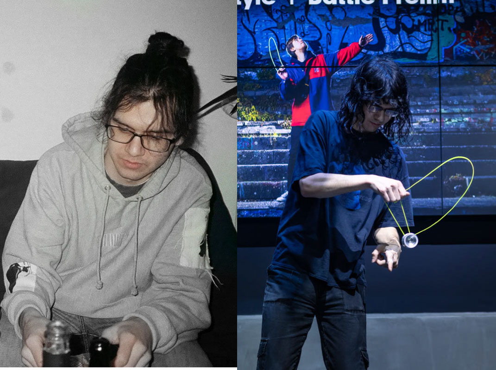

# Jindrich Polivka

  

                                                                        
## Hi, Iam Jindra
## I am aspiring to be a graphic designer, currently in my 3rd year towards a bachelors degree, studying at the University of creative communications in Prague.
                                                                                                                                                      

# Work
## Viola theatre
### Visual identity for a small theatre with long tradition.
### The plain look reflects look of the stage and auditorium as well as nature of the plays presented in it. These often use little to none in terms of scenery and costumes. The stage also host intimate musical performances and book readings besides theatrical plays.
                                                                        

### Posters work with a civil portrait of the leading actor(s) elsewhere than the stage, which further alludes to the intimate nature of this space, in which the actors are within an arms reach. Besides in case of this theatre the casting is typically more of a pull for it‘s audience than a given play as for it‘s small size it brings impressive starpower.
